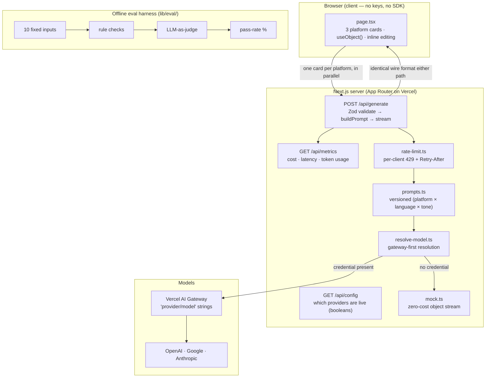

# Multilingual Content Studio

**Live demo → https://multilingual-content-studio.vercel.app**

Paste a source text once and generate platform-ready social posts — **LinkedIn**, **X**,
and **小红书 (Xiaohongshu)** — in **English / Deutsch / 中文** with tone control, streamed
live token-by-token. AI-assisted draft, human review on top.

Built with Next.js (App Router) + TypeScript, the [Vercel AI SDK v6](https://sdk.vercel.ai),
Zod, and the [Vercel AI Gateway](https://vercel.com/docs/ai-gateway).

> The public demo runs against a zero-cost **mock** model, so the full UX — multi-platform
> parallel streaming, per-card editing, tone/language switches — works without any key or
> spend. Add an `AI_GATEWAY_API_KEY` to stream from a real model through the exact same pipeline.

## 60-second demo

On the [live URL](https://multilingual-content-studio.vercel.app):

1. **Paste** a paragraph into the source box (e.g. a product-launch announcement).
2. **Pick** a target language (English / Deutsch / 中文) and a tone (Professional / Casual / Punchy).
3. **Generate.** All three platform cards — LinkedIn, X, Xiaohongshu — stream **in parallel**,
   token by token, each respecting its own length and hashtag constraints.
4. **Edit** any card inline; the title, body, and hashtags are independently editable.
5. **Switch** language or tone and regenerate — the output localizes and re-tones live.

That's the core loop: *write once → on-brand, reviewable drafts in every language*.

## Getting started

```bash
pnpm install
cp .env.example .env.local   # optional — see "Environment variables" below
pnpm dev                     # http://localhost:3200
```

With **no** credential configured the app runs end to end against a built-in **mock**
model (zero cost), so you can develop the full UX without a key. Add a credential to
stream from a real model.

## Architecture



The browser only ever talks to `POST /api/generate`; model calls and keys never reach the
client. The request is validated with Zod against the prompt registry, the prompt is
composed from `(platform × language × tone)` in `lib/prompts.ts`, and a typed object
(`title? · body · hashtags`) is streamed back with `streamObject(...)`. The mock and the
real model emit the **identical** wire format (growing JSON), so the client (`useObject`)
parses them identically and the app is unchanged either way.

| Path | Role |
| --- | --- |
| `app/page.tsx` | Three per-platform cards, each streaming + independently editable. |
| `app/api/generate/route.ts` | Zod-validated structured streaming endpoint (+ rate limit, metrics, prompt versioning). |
| `app/api/config/route.ts` | Reports which providers are "live" (booleans only). |
| `app/api/metrics/route.ts` | Per-request cost / latency / token usage. |
| `lib/models.ts` | Client-safe provider/model registry (no SDK imports). |
| `lib/resolve-model.ts` | Server-only gateway-first model resolution. |
| `lib/prompts.ts` | Versioned, composable prompt builder. |
| `lib/mock.ts` | Zero-cost streaming mock model. |
| `lib/eval/` | Eval harness — proves generation quality (see below). |

> Persistence (a database layer) is **off the current MVP path** and intentionally not
> part of this branch — generation and review are the focus first.

## Key tradeoffs

These were the load-bearing decisions; each is a deliberate pick, not a default.

- **Per-platform calls, not one mega-prompt.** Each platform gets its own model call instead
  of asking one prompt for all three at once. It costs more calls, but: cards **stream in
  parallel** (a slow X draft never blocks LinkedIn), each prompt is small and focused so the
  model adheres to that platform's constraints far better, a single failure or retry is
  **isolated** to one card, and the per-platform prompt fragments stay independently
  versionable. The mega-prompt's one-shot token savings weren't worth the coupled latency,
  weaker constraint adherence, and all-or-nothing failure mode.
- **Structured output, not free text.** `streamObject` against a shared Zod schema returns a
  typed `{ title?, body, hashtags }` instead of a blob the client has to parse. The UI binds
  each field to its own editable region, the rule-based evals can check fields directly, and
  malformed output is caught at the schema boundary rather than downstream.
- **Streaming, not request/response.** `streamObject(...).toTextStreamResponse()` shows tokens
  as they arrive — the perceived latency of a multi-second generation drops to "instant first
  paint," which matters a lot for a draft-and-review loop.
- **Gateway-first, no hard-wired provider SDK.** `resolve-model.ts` resolves `"provider/model"`
  strings through the Vercel AI Gateway when a credential exists, falls back to a provider SDK
  only if its key is set, and to the mock otherwise. One credential covers every provider and
  the client never changes.

## Environment variables

All variables are optional; see [`.env.example`](./.env.example). Set them in
`.env.local` for local dev (git-ignored) or in the Vercel project for deployments.
**Never commit real keys.**

| Variable | Required? | Purpose |
| --- | --- | --- |
| `AI_GATEWAY_API_KEY` | Preferred | Routes every provider through the Vercel AI Gateway using `"provider/model"` strings. One key covers OpenAI, Google, and Anthropic — no provider SDK key needed. |
| `VERCEL_OIDC_TOKEN` | Auto on Vercel | Auto-injected on Vercel deployments; authenticates the AI Gateway with no manual key. |
| `OPENAI_API_KEY` | Fallback | Enables OpenAI models directly when the gateway is not configured. |
| `GOOGLE_GENERATIVE_AI_API_KEY` | Fallback | Enables Google Gemini models directly. |
| `ANTHROPIC_API_KEY` | Fallback | Enables Anthropic Claude models directly. |

**Credential resolution order** (see `lib/resolve-model.ts`):

1. **AI Gateway** — if `AI_GATEWAY_API_KEY` or `VERCEL_OIDC_TOKEN` is present, the model
   is resolved as a `"provider/model"` string through the gateway. No provider SDK is used.
2. **Provider SDK fallback** — otherwise, if the selected provider's own key is set, that
   provider's SDK is used directly (the "unless required" escape hatch).
3. **Mock** — if neither is available, the request streams the mock model.

### Where keys live (local vs. production)

Keys are **never** committed — they live in environment variables, not in any
tracked file:

- **Local dev** — put them in `.env.local` (git-ignored). `cp .env.example .env.local`
  and fill in one credential. Next.js loads it automatically on `pnpm dev`.
- **Production / preview** — set them on the Vercel project, scoped per environment:

  ```bash
  vercel env add AI_GATEWAY_API_KEY production   # also: preview, development
  vercel deploy --prod                           # env changes only apply to NEW deploys
  ```

  (Or Vercel dashboard → Project → Settings → Environment Variables.) An existing
  deployment keeps the env it was built with, so **redeploy after adding a key.**
  Pull prod vars into local with `vercel env pull .env.local`.

### Which provider/model gets used

That is **not** an env var — it's a runtime choice. The selectable providers and models
are a code registry in [`lib/models.ts`](./lib/models.ts); the user picks one in the UI
header dropdown, and the default is `openai/gpt-4o-mini` (`DEFAULT_PROVIDER` /
`DEFAULT_MODEL`). The env credential only decides *whether* that selection runs live or
falls back to the mock — it does not pick the model.

> **Cost note for the public demo.** The public URL is intentionally credential-free so it
> runs on the mock at zero cost. Attaching a live `AI_GATEWAY_API_KEY` to the **production**
> environment makes every visitor generation a real, billable gateway call. Per-IP rate
> limiting (POS-9) caps abuse, but for an open demo prefer enabling the live key only on
> `preview`/`development`, or set a spend cap in the AI Gateway dashboard.

## Eval harness

The eval harness is how we _prove_ generation works and measure the effect of prompt
changes. It runs 10 fixed, varied inputs (`lib/eval/dataset.ts` — across length, topic,
and the en/de/zh languages × every platform) through `generate → rule checks → LLM judge`
and prints a **pass-rate %**.

**Latest run** (`gpt-4o-mini` generating, `gpt-4o` judging — see [`eval-results/latest.json`](./eval-results/latest.json)):

| Metric | Result |
| --- | --- |
| **Pass rate** | **100% (10/10)** |
| Overall judge average | 4.75 / 5 |
| Constraint adherence | 4.5 / 5 |
| Language correctness | 5.0 / 5 |
| Key-point capture | 4.7 / 5 |
| Tone match | 4.8 / 5 |

```bash
pnpm eval            # live if a credential is present, else a mock dry run
pnpm eval --mock     # force the offline mock pipeline (no model calls, no cost)
```

Each output is scored two ways:

- **Rule-based** (`lib/eval/rules.ts`, deterministic): body length ≤ platform limit,
  hashtag count in range, required title present, and a language sanity check.
- **LLM-as-judge** (`lib/eval/judge.ts`): a _second, independent_ model grades each
  output 1–5 on four rubric dimensions — constraint adherence, target-language
  correctness, key-point capture, and tone match.

A case passes only when **every rule check passes AND every judge dimension ≥ 3**. Configure
with env vars: `EVAL_GEN_MODEL`, `EVAL_JUDGE_MODEL` (both `"provider/model"`),
`EVAL_MIN_PASS_RATE` (CI gate, default 70), `EVAL_CONCURRENCY`.

Runs are keyed by a **prompt fingerprint** (the set of fragment versions from
`lib/prompts.ts`) and appended to `eval-results/history.jsonl`, so bumping a template
version lands as a new datapoint and the harness reports the pass-rate delta vs. the last
comparable run. The harness exits non-zero when the pass-rate is below the gate, so it
doubles as a CI check. The deterministic scoring logic is unit-tested in
`lib/eval/eval.test.ts` (runs offline in `pnpm test`).

## Deploy

Deployed on [Vercel](https://vercel.com/new) → **https://multilingual-content-studio.vercel.app**.
On Vercel the AI Gateway authenticates via the auto-injected `VERCEL_OIDC_TOKEN`, so no key
configuration is needed to stream live. With no credential at all, the deployment still serves
the full mock experience at zero cost.
